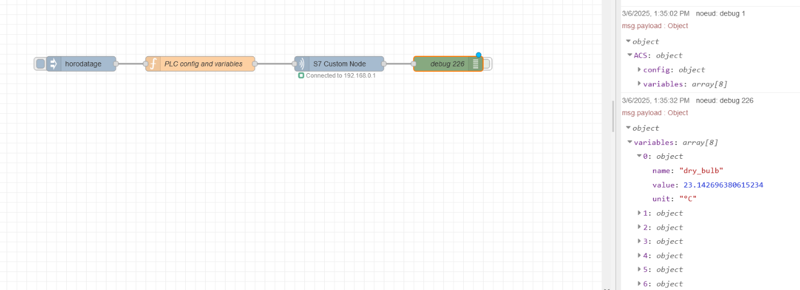

# nodes7_dynamic

**nodes7_dynamic** is a library which allows communication to S7 PLCs, using the Siemens S7Communication protocol over ISO-on-TCP (RFC1006). It is based on the _nodes7_ module, and was created in order to overcome the [node-red-contrib-s7](https://www.npmjs.com/package/node-red-contrib-s7)'s issue. This library works really well for many use cases, but it is unfortunately impossible to put dynamic variables in the configuration interface. Thus, the **nodes7_dynamic** initiates the connection and
allows the user to inject an object in the configuration fields. You can then create a configuration file of your PLC, containing both the configuration (host, port, cycletime...) and the variables you want to read. The output of this node will deliver an object with all those information.


## configuration_file.json example

```json
{
	"ACS":{ // PLC, do not change
    "config": {
  		"serial_number": "SERIAL_NUMBER",
  		"part_number": "PART_NUMBER",
  		"name": "NAME",
  		"code": "XXX",
      "host": "192.168.0.1", // Example
      "port": "102", // Do not change
      "rack": "0",
      "slot": "1",
      "timeout": "10000", // Time (in ms) for reattempt a connection to the PLC
      "cycletime": "30000" // Reading variable time (in ms) 
    },
    "variables": [
        {
            "name": "dry_bulb",
            "value": "DB85,REAL0", // Returns the value
            "unit": "°C"
        },{
            "name": "wet_bulb",
            "value": "DB85,REAL4",
            "unit": "°C"
        },{
            "name": "low_stage_suction_pressure",
            "value": "DB85,REAL24",
            "unit": "bar"
        },{
            "name": "low_stage_discharge_pressure",
            "value": "DB85,REAL28",
            "unit": "bar"
        },{
            "name": "capacitive_probe",
            "value": "DB85,REAL60",
            "unit": "%"
        },{
            "name": "Safety_temperature_switch",
            "value": "DB86,X0.0",
            "unit": "boolean"
        },{
            "name": "overload_cutout",
            "value": "DB86,X0.1",
            "unit": "boolean"
        },{
            "name": "thermal_cutout",
            "value": "DB86,X0.2",
            "unit": "boolean"
        }    
    ]
	}
}
```

## Example Flow
Here is a flow example provided to help you to understand how to use the node :


```js
[{"id":"d9931134a4531484","type":"tab","label":"Test","disabled":false,"info":"","env":[]},{"id":"9343442e7e03ea8a","type":"nodes7_custom_node","z":"d9931134a4531484","name":"","host":"msg.payload.ACS.config.host","port":"msg.payload.ACS.config.port","rack":"msg.payload.ACS.config.rack","slot":"msg.payload.ACS.config.slot","timeout":"msg.payload.ACS.config.timeout","cycletime":"msg.payload.ACS.config.cycletime","x":730,"y":260,"wires":[["4d4eac93cf09eaa4"]]},{"id":"6aac923b3d2e5b1f","type":"inject","z":"d9931134a4531484","name":"","props":[{"p":"payload"},{"p":"topic","vt":"str"}],"repeat":"","crontab":"","once":false,"onceDelay":0.1,"topic":"","payload":"","payloadType":"date","x":210,"y":260,"wires":[["f4ddbb63eb782289"]]},{"id":"f4ddbb63eb782289","type":"function","z":"d9931134a4531484","name":"PLC config and variables","func":"msg.payload = \n{\n    \"ACS\":{\n        \"config\": {\n            \"serial_number\": \"SERIAL_NUMBER\",\n            \"part_number\": \"PART_NUMBER\",\n            \"name\": \"NAME\",\n            \"code\": \"XXX\",\n            \"host\": \"192.168.0.1\", // Example\n            \"port\": \"102\", // Do not change\n            \"rack\": \"0\",\n            \"slot\": \"1\",\n            \"timeout\": \"10000\", // Time (in ms) for reattempt a connection to the PLC\n            \"cycletime\": \"30000\" // Reading variable time (in ms) \n        },\n        \"variables\": [\n            {\n                \"name\": \"dry_bulb\",\n                \"value\": \"DB85,REAL0\", // Returns the value\n                \"unit\": \"°C\"\n            },{\n                \"name\": \"wet_bulb\",\n                \"value\": \"DB85,REAL4\",\n                \"unit\": \"°C\"\n            },{\n                \"name\": \"low_stage_suction_pressure\",\n                \"value\": \"DB85,REAL24\",\n                \"unit\": \"bar\"\n            },{\n                \"name\": \"low_stage_discharge_pressure\",\n                \"value\": \"DB85,REAL28\",\n                \"unit\": \"bar\"\n            },{\n                \"name\": \"capacitive_probe\",\n                \"value\": \"DB85,REAL60\",\n                \"unit\": \"%\"\n            },{\n                \"name\": \"Safety_temperature_switch\",\n                \"value\": \"DB86,X0.0\",\n                \"unit\": \"boolean\"\n            },{\n                \"name\": \"overload_cutout\",\n                \"value\": \"DB86,X0.1\",\n                \"unit\": \"boolean\"\n            },{\n                \"name\": \"thermal_cutout\",\n                \"value\": \"DB86,X0.2\",\n                \"unit\": \"boolean\"\n            }    \n        ]\n    }\n}\nreturn msg;","outputs":1,"timeout":0,"noerr":0,"initialize":"","finalize":"","libs":[],"x":450,"y":260,"wires":[["9343442e7e03ea8a"]]},{"id":"4d4eac93cf09eaa4","type":"debug","z":"d9931134a4531484","name":"debug 226","active":true,"tosidebar":true,"console":false,"tostatus":false,"complete":"payload","targetType":"msg","statusVal":"","statusType":"auto","x":950,"y":260,"wires":[]}]
```


